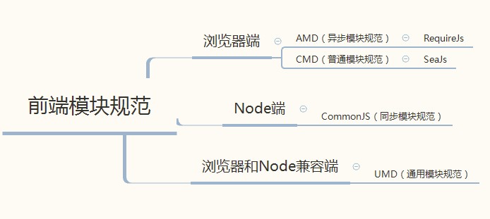

# ABOUT JS模块

## 1、引言-背景
模块化这个问题并非一开始就存在，WWW刚刚问世的时候，html，JavaScript，CSS都是极其简单的存在，并不需要模块化。

#### 1.1 模块化的需求是规模的产物
当web page进化到web application，浏览器端处理的逻辑越来越复杂，展现的样式和动画越来越多，业务逻辑也越来越复杂，对于工程的要求也就越来越高。于是模块化的需求也就产生了。

#### 1.2 什么是模块化 ？
模块化是一种将系统分离成独立功能部分的方法，可将系统分割成独立的功能部分，严格定义模块接口、模块间具有透明性。

#### 1.3 为什么要使用模块 ?
模块化可以使你的代码低耦合，功能模块直接不相互影响。  
模块化是工程化的需求，是为了更好的管理代码

## 2、历程（进化与类举）

#### 无模块
```
if(xx){
     //.......
}else{
     //xxxxxxxxxxx
}
for(var i=0; i<10; i++){
     //todo
}
element.onclick = function(){
     //todo
}
```

>特点：代码简单的堆在一起，只要能从上往下依次执行就可以了。


#### 模块萌芽
```
function m1(){ 
　　//... 
} 
function m2(){ 
    //... 
} 
```

>这时的模块就是实现特定功能的一组方法。把不同的函数（以及记录状态的变量）简单地放在一起，就算是一个模块。 

>上面的函数m1()和m2()，组成一个模块。使用的时候，直接调用就行了。   
缺点也很明显："污染"了全局变量，无法保证不与其他模块发生变量名冲突，而且模块成员之间看不出直接关系。 

#### 对象写法 
```
var module1 = new Object({ 
	_count : 0, 
　　m1 : function (){ 
　　	//... 
　　}, 
　　m2 : function (){ 
　　	//... 
　　} 
}); 
```

>上面的函数m1()和m2(），都封装在module1对象里。使用的时候，就是调用这个对象的属性。   
>但是，这样的写法会暴露所有模块成员，内部状态可以被外部改写(_count ++ 操作)（当然也包括内部的方法）。


#### 立即执行函数写法 
使用"立即执行函数"，可以达到不暴露私有成员的目的。

```
var module1 = (function(){ 
　　var _count = 0; 
　　var m1 = function(){ 
　　	//... 
　　}; 
　　var m2 = function(){ 
　　	//... 
	}; 
　　return { 
　　	m1 : m1, 
　　	m2 : m2 
　　}; 
})(); 
```

>问题：使用上面的写法，外部代码无法读取内部的_count变量。   
>module1就是Javascript模块的基本写法。等下，再对这种写法进行加工。   
>此时的模块化思想已经成型

### 还有一些其他的写法, 如：

#### 放大模式 

如果一个模块很大，必须分成几个部分，或者一个模块需要继承另一个模块，这时就有必要采用"放大模式"（augmentation）。 


```
var module1New = (function (mod){ 
	mod.m3 = function () { 
　　	//... 
　　}; 
　　return mod; 
})(module1); 
```
>上面的代码为module1模块添加了一个新方法m3()，然后返回新的module1模块。 

#### 宽放大模式

>在浏览器环境中，模块的各个部分通常都是从网络上获取的，有时无法知道哪个部分会先加载。如果采用上一节的写法，第一个执行的部分有可能加载一个不存在空对象，这时就要采用"宽放大模式"。 

```
var module1 = ( function (mod){ 
	//... 
　　return mod; 
})(window.module1 || {}); 
```
>与"放大模式"相比，＂宽放大模式＂就是"立即执行函数"的参数可以是空对象。 

#### 输入全局变量 

独立性是模块的重要特点，模块内部最好不与程序的其他部分直接交互。  
为了在模块内部调用全局变量，必须显式地将其他变量输入模块。 

```
var module1 = (function ($, Tatami) { 
	//... 
})(jQuery, Ttm);
```

>上面的module1模块需要使用jQuery和Ttm，就把这两个库（其实是两个模块）当作参数输入module1。这样做除了保证模块的独立性，还使得模块之间的依赖关系变得明显。


### 3、模块化的推进与繁荣

[各种现代模块推演](https://blog.csdn.net/Real_Bird/article/details/54869066)

js模块化编程，已经成为一个迫切的需求。理想情况下，开发者只需要实现核心的业务逻辑，其他都可以加载别人已经写好的模块。


#### 各种标准出现了（CommonJS、AMD、CMD、UMD、ES6）



#### 3.1 commonJS(Node)

[阮老师 commonJS module](http://javascript.ruanyifeng.com/nodejs/module.html)

CommonJS是一个更偏向于服务器端的规范。CommonJS的一个模块就是一个脚本文件。require命令第一次加载该脚本时就会执行整个脚本，然后在内存中生成一个对象(如下)。

```
{
  id: '...',
  exports: { ... },
  loaded: true,
  ...
}
```

>以后需要用到这个模块时，就会到exports属性上取值。即使再次执行require命令，也不会再次执行该模块，而是到缓存中取值。

```
//math.js
exports.add = function() {
    var sum = 0, i = 0, args = arguments, l = args.length;
    while (i < l) {
        sum += args[i++];
    }
    return sum;
};

//increment.js
var add = require('math').add;
exports.increment = function(val) {
    return add(val, 1);
};
```

由于CommonJS是同步加载模块，这对于服务器端不是一个问题，因为所有的模块都放在本地硬盘。等待模块时间就是硬盘读取文件时间，很小。但是，对于浏览器而言，它需要从服务器加载模块，涉及到网速，代理等原因，一旦等待时间过长，浏览器处于”假死”状态。

所以在浏览器端，不适合于CommonJS规范。所以在浏览器端又出现了一个规范—---AMD。


#### 3.2 AMD(requireJs)
AMD(Asynchronous Module Definition)异步模块定义。异步强调的是，在加载模块以及模块所依赖的其它模块时，都采用异步加载的方式，避免模块加载阻塞了网页的渲染进度。


模块定义：

```
define([module-name?], [array-of-dependencies?], [module-factory-or-object]);
```

>id：模块的名字，如果没有提供该参数，模块的名字应该默认为模块加载器请求的指定脚本的名字；  
>dependencies：模块的依赖，已被模块定义的模块标识的数组字面量。  
>factory：模块的工厂函数，模块初始化要执行的函数或对象。  


AMD也采用require命令加载模块，但是不同于CommonJS，它要求两个参数：

require([module], callback);

>第一个参数[module]，是一个数组，里面的成员是要加载的模块，callback是加载完成后的回调函数。

```
// math.js
define(function() {
  var add = function(x, y) {
    return x + y;
  }

  return  {
    add: add
  }
})

// main.js
require(['math'], function(math) {
  alert(math.add(1, 1));
})
```

>当require()加载math模块的时候，就会先加载它依赖的模块。当有多个依赖时，就将所有的依赖都写在define()函数第一个参数数组中，所以说AMD是依赖前置的。这不同于CMD规范，它是依赖就近的。

[AMD加载的实现](https://github.com/creeperyang/amd-loader)

#### 3.3 CMD(seaJS)
CMD（即Common Module Definition通用模块定义）

CMD推崇依赖就近，延迟执行。可以把你的依赖写进代码的任意一行，如下：

```
define(factory)
```

factory为函数时，表示是模块的构造方法。执行该构造方法，可以得到模块向外提供的接口。factory 方法在执行时，默认会传入三个参数：require、exports 和 module.

```
define(function(require, exports, module) {
  var a = require('./a');
  a.doSomething();
  var b = require('./b');
  b.doSomething();
})
```

>因为CMD推崇一个文件一个模块，所以经常就用文件名作为模块id
CMD推崇依赖就近，所以一般不在define的参数中写依赖，在factory中写。
>sea.js通过sea.use()来加载模块。 seajs.use(id, callback?)


##### AMD与CMD 区别联系
SeaJS要解决的问题和requireJS一样，只不过在模块定义方式和模块加载（可以说运行、解析）时机上有所不同。

AMD和CMD都是用define和require。

CMD标准倾向于在使用过程中提出依赖，就是不管代码写到哪突然发现需要依赖另一个模块，那就在当前代码用require引入就可以了，规范会帮你搞定预加载，你随便写就可以了。但是AMD标准让你必须提前在头部依赖参数部分写好。

虽然都是并行加载js文件，但还是有所区别，AMD是预加载，在并行加载js文件同时，还会解析执行该模块（因为还需要执行，所以在加载某个模块前，这个模块的依赖模块需要先加载完成）；而CMD是懒加载，虽然会一开始就并行加载js文件，但是不会执行，而是在需要的时候才执行。

AMD优点：加载快速，尤其遇到多个大文件，因为并行解析，所以同一时间可以解析多个文件。

AMD缺点：并行加载，异步处理，加载顺序不一定，可能会造成一些困扰，甚至为程序埋下大坑。

CMD优点：因为只有在使用的时候才会解析执行js文件，因此，每个JS文件的执行顺序在代码中是有体现的，是可控的。

CMD缺点：执行等待时间会叠加。因为每个文件执行时是同步执行（串行执行），因此时间是所有文件解析执行时间之和，尤其在文件较多较大时，这种缺点尤为明显。


#### 3.4 UMD (Universal Module Definition 通用模块定义)

既然CommonJs和AMD风格一样流行，似乎缺少一个统一的规范。所以产生了这样的需求，希望有支持两种风格的“通用”模式，于是通用模块规范（UMD）诞生了。

>UMD希望提供一个前后端跨平台的解决方案(支持AMD与CommonJS模块方式)

```
(function (root, factory) {
    if (typeof define === 'function' && define.amd) {
        // AMD
        define(['jquery', 'underscore'], factory);
    } else if (typeof exports === 'object') {
        // Node, CommonJS之类的
        module.exports = factory(require('jquery'), require('underscore'));
    } else {
        // 浏览器全局变量(root 即 window)
        root.returnExports = factory(root.jQuery, root._);
    }
}(this, function ($, _) {
    function a(){}; 
    function b(){}; 
    function c(){};
    return {
        b: b,
        c: c
    }
}));
```

>先判断是否支持Node.js模块格式（exports是否存在），存在则使用Node.js模块格式。  
再判断是否支持AMD（define是否存在），存在则使用AMD方式加载模块。   
前两个都不存在，则将模块公开到全局（window或global）。  

更多有关UMD的例子在Github上的[官方repo](https://github.com/umdjs/umd)


#### 3.5 ES6 终极boss
新的、我们在用的东西、新规范、代表未来、牛逼。

>es6 模块新的标准在设计上是兼容已经存在的CommonJS和AMD模块的。

es6通过import、export实现模块的输入输出。import命令用于输入其他模块提供的功能，export命令用于规定模块的对外接口。

```
//a.js
export {a, b, c};

//b.js
import {a, b, c } from 'a.js';

//expt.js
export function abc(){}//export 一个命名的function  
export default function(){} //export default function  
export num = 123 //export 一个数值  
export obj = {}  
export { obj as default };

//import
import expt from 'expt'//default export  
import {default as myModule} from 'expt' //rename  
import {abc,num,obj} from 'expt' 
```

你可能要注意的地方：

* 所有的import和export只能写在顶级作用域中。你不能在条件判断语句和函数作用域内使用import。
* 所有导出的变量名必须是显式的，你不能通过遍历一个数组，动态生成一组导出名进行导出。
* 模块对象都是被冻结的，不能通过polyfill为它添加新的特性。
* 对于import的错误，无法进行recovery。一个应用可能依赖许多的模块，一旦有一个模块加载失败，这个应用都不会运行。你不能在try/catch中使用import。正是因为es6的模块表现得如此静态，webpack才能在编译的时候检测出代码中的错误。
* 你没法为一个模块在加载所有依赖项之前添加钩子，这意味着一个模块没有办法控制其依赖项的加载方式

只举一个例子  like ...

```
try {
    import es6 from './es6.js';
} catch (error) {
    console.log(error);
}
```


[阮老师关于module](http://es6.ruanyifeng.com/#docs/module)  

##### 再看一把es6与commonjs区别

```
es6 {
　　export: '可以输出多个，输出方式为 {}' ，
　　export  default : ' 只能输出一个 ，可以与export 同时输出，但是不建议这么做'，
　　解析阶段确定对外输出的接口，解析阶段生成接口，
　　模块不是对象，加载的不是对象，
　　可以单独加载其中的某个接口（方法），
　　静态分析，动态引用，输出的是值的引用，值改变，引用也改变，即原来模块中的值改变则该加载的值也改变，
　　this 指向undefined
}

commonJS {
　　module.exports =  xxx : '只能输出一个，且后面的会覆盖上面的' ，
　　exports.  xxx : ' 可以输出多个'，
　　运行阶段确定接口，运行时才会加载模块，
　　模块是对象，加载的是该对象，
　　加载的是整个模块，即将所有的接口全部加载进来，
　　输出是值的拷贝，即原来模块中的值改变不会影响已经加载的该值，
　　this 指向当前模块
}
```


[commonjs与es6区别](http://caibaojian.com/es6/module.html)

>在结合es6模块和commonJS模块的区别之后，我们知道es6的特点是静态解析，而commonJS模块的特点是动态解析的，因此，借于es6模块的静态解析，tree-shaking的实现才能成为可能。

#### 3.6 目前的我们----少不了webpack

虽然不算是模块化规范，但是为我们解决模块问题提供了极大帮助。

[webpack模块化原理 见上篇]()
[require 加载原理 见上篇]()


### 4、拨开云雾

模块的本质：模块化相当于闭包开发， 接口导出就相当于将父函数（模块）内的子函数给暴漏到父函数外。

### 5、总结必备

#### 5.1 模块化的优缺点： 

##### 优点： 
(1)可维护性  

* 灵活架构，焦点分离  
* 方便模块间组合、分解   
* 方便单个模块功能调试、升级  
* 多人协作互不干扰  

(2)可测试性  

* 可分单元测试  

##### 缺点： 
性能损耗  

* 系统分层，调用链会很长  
* 模块间通信,模块间发送消息会很耗性能  

#### 5.2 模块化的意义
* 组件的复用，降低开发成本和维护成本
* 组件单独开发，方便分工合作
* 模块化遵循标准，方便自动化依赖管理，代码优化，部署
